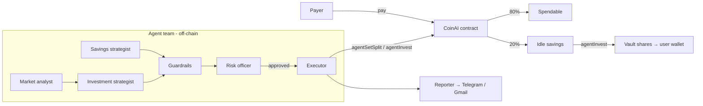

<div align="center">
  
  <h1>coinAI</h1>
  <p>An AI agent team that saves a slice of every payment and puts it to work on BNB Chain — inside limits the user signs on-chain.</p>

  
  
  
</div>

---


## The problem

Saving depends on willpower. Money lands in one place and stays there until it is spent, and even people who do save leave it idle because picking where to put it is one more chore. "AI finance agents" promise to help, but handing an LLM your wallet is a non-starter.

## What coinAI does

1. **Auto-split** — every payment received through coinAI is split on arrival: part stays spendable, part goes to savings (default 20%).
2. **AI agent team** — a market analyst reads BNB, BTC, ETH and CAKE from **Chainlink price feeds on BNB Chain**; a savings strategist tunes the split to your real income; an investment strategist spreads idle savings across Conservative / Balanced / Growth vaults based on your investor profile and the market; a risk officer can veto any move.
3. **Guardrails on-chain** — you sign the limits (`setAgent(agent, minSplit, maxSplit, expiry)`). The contract lets the agent do exactly two things inside those limits, and has **no code path that sends funds anywhere but you**.
4. **Everything on the record** — each agent action emits `AgentAction(user, agent, action, reason)`, readable on BscScan, in the app's decision log, and in a daily report on **Telegram or email**.



## Why this fits the AI Agents track

- **The AI acts, not just chats.** Agents read on-chain state, decide, and execute transactions from their own wallet.
- **It reads the real market.** Live prices come from Chainlink oracles on BNB Smart Chain, trend and volatility from Binance; the analyst's regime read drives how savings are invested.
- **Multi-agent by design.** A market analyst, two strategists in parallel, deterministic guardrails, a risk officer, an executor and a reporter — each with its own page in the app. Orchestration is plain code, so the flow is predictable and auditable.
- **Safe by construction.** Prompt injection or a bad model call can at worst move the split inside your range or move your savings into your own vault position. The contract rejects everything else.

## Does the agent team help?

Replayed over the last 365 days of real BNB, BTC and ETH prices (2025-10-07 → 2026-10-06: 53 risk-on, 215 neutral, 97 risk-off days) for three income patterns, each spending 26 tUSDT a day. **Fixed rule:** save 20% of every payment into the Balanced vault. **Agent:** the team's prompt rules written as code (split rule + the profile's reference mix tilted by a rule-based market read, bounded exactly like a live run). Testnet vaults (fixed APY):

| Income | Saved (fixed → agent) | Days short of spending money | Worst dip | Gain | Agent's average split |
|---|---|---|---|---|---|
| Monthly salary | 2,600 → **3,000** | 0 → **0** | 0% → 0% | 3.09% → 3.50% | 23.3% |
| Freelance (irregular, one dry spell) | 2,605 → 1,365 | 23 → **11** | 0% → 0% | 2.81% → 3.18% | 10.7% |
| Daily gig | 2,184 → 1,267 | 27 → **0** | 0% → 0% | 3.06% → 3.72% | 11.5% |

With market-linked vaults (roadmap F6 preview: Balanced half-tracks BTC, Growth half-tracks BNB + ETH):

| Income | Worst dip (fixed → agent) | Gain |
|---|---|---|
| Monthly salary | 11.37% → **9.31%** | 7.56% → 6.66% |
| Freelance | 18.91% → **14.05%** | 9.04% → 6.86% |
| Daily gig | 8.48% → **6.89%** | 8.21% → 5.13% |

- **Salary:** the agent saves 15% more and never leaves the user short: it raises the split only while money from the last payday is still left over, and stops when that cushion keeps shrinking.
- **Irregular income:** the agent saves less on purpose and cuts the days without spending money from 23 to 11 (freelance) and 27 to 0 (gig).
- **Market risk:** with market-linked vaults the agent's dips are 18–26% shallower; in exchange it gave up some gain in this window's rallies.

The replay caught two flaws in the strategists' own rules (a "long gap" measured in absolute days, which punished monthly salaries, and raising the split without checking anything was left over); both are fixed in the prompts too. A live-model spot check compares the real strategists with these rules at sampled moments. Rerun: `cd web && npx tsx scripts/evaluate-agents.ts` (the panel on AI Portfolio reads its output). Details: [docs/ai-agents.md](docs/ai-agents.md#agent-team-vs-a-fixed-rule).

## Features

| Feature | Where |
|---|---|
| Auto-savings split on every payment | `CoinAI.pay()` |
| Shareable payment links | `/pay/:address`, `/app/link` |
| Invoices in rupiah or tUSDT (memo, reference, paid only once verified on-chain) | `/app/link`, `/pay/:address?invoice=` |
| Telegram receipt for every payment, with what was saved | `web/api/_lib/receipts.ts` |
| Withdraw vault positions back to the wallet | `/app/withdraw` (Vault tab) |
| Group funds: Patungan (all-or-nothing chip-in with refunds), Iuran (dues with who's paid up), Donasi (fundraising with memo'd payouts); a downloadable share card (feed / story) and link previews for `/g/:id` | `/groups`, `GroupFunds.sol` |
| Three yield vaults (3% / 6% / 12% simulated APY) | `/app/yield` |
| AI agent permission, run-now, chat, decision log | `/app/agent` |
| One page per agent (market board, investor profile, limits, …) | `/app/agent/:role` |
| Live market: BNB, BTC, ETH, CAKE via Chainlink on BSC | `/app/agent/market` |
| Chat with coinAI on the web **and on Telegram** (same advisor) | `/app/agent`, `web/api/telegram.ts` |
| Daily report + reminders on Telegram / Gmail | `web/api/cron/daily.ts` |
| Time-lock on savings | `/app/rules` |
| tUSDT faucet (1,000 / day) + tBNB faucet link | `/app/faucet` |
| English, Bahasa Indonesia, 简体中文 | `web/src/lib/i18n.tsx` |

## Deployed contracts (BSC Testnet, chain 97)

Deployed from block 133234240 (MockUSDT; the vaults and CoinAI in 133234241). Source of truth: [`deployments.json`](deployments.json).

| Contract | Address |
|---|---|
| CoinAI | [`0xdA174816F66E30eBB3a002bcf5a71AD00037eBD9`](https://testnet.bscscan.com/address/0xdA174816F66E30eBB3a002bcf5a71AD00037eBD9) |
| MockUSDT (tUSDT, 6 decimals) | [`0x49eD8CC30FC55Ed36e976285d98eF00F213C31E2`](https://testnet.bscscan.com/address/0x49eD8CC30FC55Ed36e976285d98eF00F213C31E2) |
| Conservative vault (3% APY, low risk) | [`0x1b013Af5755CB96d9314A5074391931EBCd40ACa`](https://testnet.bscscan.com/address/0x1b013Af5755CB96d9314A5074391931EBCd40ACa) |
| Balanced vault (6% APY, medium risk) | [`0x4071DdCe831E484640e864a8627cc3ece308e895`](https://testnet.bscscan.com/address/0x4071DdCe831E484640e864a8627cc3ece308e895) |
| Growth vault (12% APY, high risk) | [`0xf9B035426d2A16EF00F0547dc0F4Ed9226D2671d`](https://testnet.bscscan.com/address/0xf9B035426d2A16EF00F0547dc0F4Ed9226D2671d) |
| DepositRouter (tBNB → tUSDT on-ramp) | [`0x2e72901f3350b7f3f5E4E35918a6e4b4dC5bf104`](https://testnet.bscscan.com/address/0x2e72901f3350b7f3f5E4E35918a6e4b4dC5bf104) |
| Agent wallet (the AI team's executor) | [`0x03c8faF61c40F35CCFFd8fDcCa7F037C2dB2f6C6`](https://testnet.bscscan.com/address/0x03c8faF61c40F35CCFFd8fDcCa7F037C2dB2f6C6) |

**coinAI v2** (deployed from block 135234110, source verified on [Sourcify](https://sourcify.dev), exact match). The app moves to it next; v1 keeps working meanwhile.

| Contract | Address | What it does |
|---|---|---|
| CoinAIV2 | [`0x2Cf391a4074927a6D3b5B81af3D3D993D00DF515`](https://testnet.bscscan.com/address/0x2Cf391a4074927a6D3b5B81af3D3D993D00DF515) | Split, savings held per user (vaults + basket, under the lock), several agents with scoped skills (split / invest + rebalance / pay dues), `payMany` |
| BasketVault | [`0x53bc4990EF969F60Cf39650212019a89742052ed`](https://testnet.bscscan.com/address/0x53bc4990EF969F60Cf39650212019a89742052ed) | **AI Smart Money**: a tUSDT/BNB/BTC/ETH/CAKE basket per saver, priced by Chainlink, weighted by the agent team within on-chain caps (≥10% stable, ≤50% per coin, ≤20% CAKE) |
| GroupFunds | [`0x1129b2C358360C1eaC3C379Cf05f87028A5855d1`](https://testnet.bscscan.com/address/0x1129b2C358360C1eaC3C379Cf05f87028A5855d1) | Patungan (all-or-nothing with refunds), Iuran (dues with paid-up status), Donasi (fundraising with memo'd payouts) |
| AgentRegistry | [`0xD063CeD905bD9034778e86e9d98716b79B85405E`](https://testnet.bscscan.com/address/0xD063CeD905bD9034778e86e9d98716b79B85405E) | Hireable agent skills: Athena (invest), Demeter (split), Hermes (pay dues, 1 tUSDT / 30 days) |

Price feeds used by the Market Analyst: Chainlink on BSC Testnet — [BNB/USD](https://testnet.bscscan.com/address/0x2514895c72f50D8bd4B4F9b1110F0D6bD2c97526), [BTC/USD](https://testnet.bscscan.com/address/0x5741306c21795FdCBb9b265Ea0255F499DFe515C), [ETH/USD](https://testnet.bscscan.com/address/0x143db3CEEfbdfe5631aDD3E50f7614B6ba708BA7), [CAKE/USD](https://testnet.bscscan.com/address/0x81faeDDfeBc2F8Ac524327d70Cf913001732224C).

## Repository layout

```
├── evm/                  # Solidity contracts (Foundry)
│   ├── src/Save.sol          # CoinAI: split, savings, vault routing, agent delegation
│   ├── src/SimpleVault.sol   # ERC-4626 vault (x3)
│   ├── src/MockUSDT.sol      # 6-decimal test stablecoin with faucet
│   └── script/DeployAll.s.sol
├── web/                  # React app + agent backend (Vercel)
│   ├── src/                  # Frontend (Vite, React 19, wagmi, ethers)
│   └── api/                  # Vercel Functions: agent team, chat, notifications, cron
├── docs/                 # Architecture, AI agents, deployment, development
└── deployments.json      # Deployed addresses (source of truth)
```

## Run locally

```bash
# contracts
cd evm && git submodule update --init && ~/.foundry/bin/forge test

# frontend (mock mode works without any contract or wallet setup)
cd web && npm install && npm run dev

# frontend + agent backend
cd web && npx vercel dev
```

Full guide: [docs/development.md](docs/development.md).

## Documentation

| Doc | What's in it |
|---|---|
| [Architecture](docs/architecture.md) | Contracts, frontend, backend, data flow |
| [AI agents](docs/ai-agents.md) | Agent team, guardrails, LLM setup, notifications |
| [Deployment](docs/deployment.md) | BSC Testnet deploy, Vercel, env vars, external services |
| [Development](docs/development.md) | Local setup, testing, gotchas |

## Tech

Solidity 0.8.28 + Foundry · Chainlink price feeds on BSC · React 19 + Vite + Tailwind v4 + wagmi/ethers v6 · Vercel Functions · OpenRouter (any tool-calling LLM) · Upstash Redis · Telegram Bot API · Gmail SMTP (nodemailer)

## License

MIT
