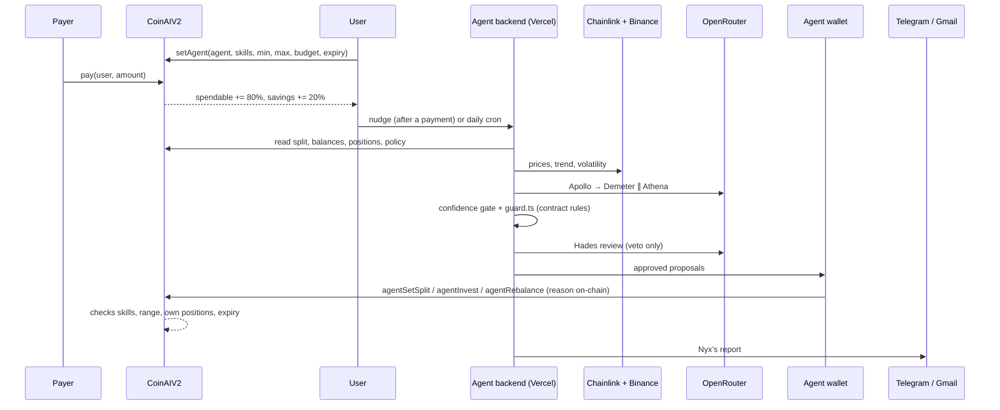
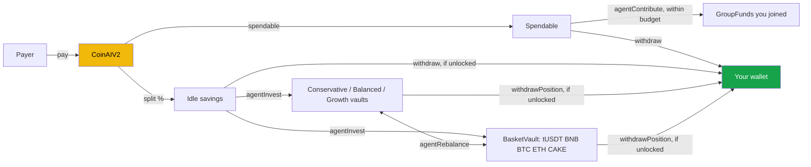

<p align="center">
  
</p>

<h1 align="center">coinAI</h1>

<p align="center">
  Auto-savings on every payment, run by a team of AI agents on BNB Chain. A slice of every payment is saved the moment it lands, and the agents put it to work inside limits you sign on-chain.
</p>

<p align="center">
  <a href="https://coinai-gamma.vercel.app"></a>
  <a href="https://github.com/maulana-tech/coinai"></a>
  <a href="https://testnet.bscscan.com/address/0x2Cf391a4074927a6D3b5B81af3D3D993D00DF515"></a>
  <a href="https://data.chain.link"></a>
  <a href="https://openrouter.ai"></a>
  <a href="#hackathon-submission"></a>
</p>

---

coinAI is an AI-agent-managed savings app on **BNB Smart Chain Testnet**. Every payment you receive through coinAI is split on arrival: part stays spendable, part goes to savings (20% by default). A council of **twelve agents** then reads the market from **Chainlink price feeds**, tunes your split to how you actually earn, spreads idle savings across three yield vaults and an **AI Smart Money basket** (tUSDT, BNB, BTC, ETH, CAKE), and can even pay your group dues, all from its own wallet.

> **The agents never hold your money, and they cannot send it anywhere but back to you.** Every limit lives in the `CoinAIV2` contract, not in a prompt.
>
> - Your savings are held per user in the contract. Vault shares and basket units are booked to **your** account
> - Each agent works only with the skills you grant it (split, invest, pay dues), inside the split range, budget and expiry you sign
> - A prompt injection or a bad model call can at worst move your split inside your range, or move savings between **your own** positions. The contract rejects everything else

<p align="center">
  
</p>

---

## Demo

https://github.com/user-attachments/assets/0fc24242-bafc-41af-b3cd-8930abfe07ad

A 46-second scroll through the live site, [coinai-gamma.vercel.app](https://coinai-gamma.vercel.app). No mock data: every balance, group and agent action is read from the chain.

**[▶ Full step-by-step demo](docs/demo.md)**: six short videos of the app, each with a timeline of what happens when.

| # | Step | Length |
|---|---|---|
| 1 | [Get test funds, deposit and get paid](docs/demo.md#1-get-test-funds-deposit-get-paid) | 1:59 |
| 2 | [Give the AI agents permission](docs/demo.md#2-give-the-ai-agents-permission) | 1:13 |
| 3 | [Market, your own pool and the agents' work on-chain](docs/demo.md#3-market-your-own-pool-and-the-agents-work-on-chain) | 1:40 |
| 4 | [Savings goals](docs/demo.md#4-savings-goals) | 0:38 |
| 5 | [Badges, invoices and paying someone](docs/demo.md#5-badges-invoices-and-paying-someone) | 0:52 |
| 6 | [Start a group fund](docs/demo.md#6-start-a-group-fund) | 1:35 |

---

## What Makes coinAI Special

### Who This Is For

Meet Rina, a freelance illustrator in Yogyakarta. Some months a client pays her three times, some months not at all. She knows she should save, but every payment lands in one balance, and by the time she thinks "I'll put some aside", it is already spent.

She tried a savings app with a fixed auto-debit. It took the same amount in a dry month and left her short for rent, so she switched it off. She has heard stablecoin vaults pay better than her bank, but choosing between them, timing the market and paying gas are three more chores she will never get to. And she would never hand an AI her wallet.

Rina's problem is not a missing product. It is that **saving is a decision she has to make again for every payment**, at the worst possible moment.

---

### The Problem

- **Saving depends on willpower.** Money lands in one place and stays spendable until it is spent
- **Fixed rules break on real income.** A flat auto-debit over-saves in a dry month and under-saves in a good one; freelancers and gig workers get both every quarter
- **Idle savings earn nothing.** Picking vaults, weights and timing is expert work, so most savings just sit
- **Money with friends is a spreadsheet.** Chip-ins, monthly dues and fundraisers run on trust and screenshots
- **"AI finance agents" ask for your keys.** Handing an LLM a wallet is a non-starter, and a prompt is not a security boundary

**How might we make saving automatic and smart for people with irregular income, without ever giving an AI custody of their money?**

---

### The Solution

coinAI answers with five pieces, each doing a job the others cannot.

**1. Savings at the payment layer.** `CoinAIV2.pay()` splits every payment the moment it lands, before anyone can spend it. Payment links, invoices, pay-many payouts and a tBNB on-ramp all go through the same split.

**2. A council of agents with real jobs.** Apollo reads the market from Chainlink on BNB Chain, Demeter tunes your split to your income, Athena invests and rebalances idle savings, Plutus curates the Smart Money basket, Hermes pays your group dues, and Hades can veto anything. Orchestration is plain code, so every run is predictable and auditable.

**3. Guardrails in the contract, mirrored in code.** You call `setAgent(agent, skills, minSplit, maxSplit, payBudget, expiry)`. The contract enforces it; `guard.ts` checks the same rules first, so a bad proposal is rejected before it costs gas.

**4. Everything on the record.** Every agent transaction carries its reason on-chain (`AgentAction(user, agent, action, reason)`), shows in the app's decision log, and lands in a daily report on Telegram or email.

**5. Savings people actually stick with.** Goals as pockets of your savings, weekly streaks, soulbound badges, referral points, group funds with link previews that show live progress, and a Telegram bot that answers in English, Bahasa Indonesia or 中文.

---

## The Agent Council

Twelve agents, one job: your money. Each has its own page in the app (`/app/agent/:role`) and a card on the landing page.

| Agent | Role | Runs on | What it may do on-chain |
|---|---|---|---|
| **Zeus** | Orchestrator: runs the team in a fixed order, after every payment and daily at 08:00 WIB | Code | Nothing by itself |
| **Apollo** | Market Analyst: BNB, BTC, ETH, CAKE from Chainlink + Binance trend and volatility → `risk_on` / `neutral` / `risk_off` | LLM | Read only |
| **Demeter** | Savings Strategist: tunes the split to your real income and spending buffer | LLM | `agentSetSplit` inside your range |
| **Athena** | Investment Strategist: spreads idle savings by your investor profile, tilted by the market read | LLM | `agentInvest`, `agentRebalance` between your own positions |
| **Perseus** | Guardrails: checks every proposal against your on-chain limits before gas is spent | Code | Nothing (rejects) |
| **Hades** | Risk Officer: an independent model that can only veto, and fails closed | LLM | Nothing (vetoes) |
| **Heracles** | Executor: sends approved moves from the agent wallet | Code | Whatever passed both checks |
| **Nyx** | Reporter: a short daily report in your language | LLM | Nothing |
| **Percy** | Advisor: chat on the web and on Telegram, can start a run | LLM | Nothing directly |
| **Plutus** | Smart Money curator: sets the basket weights from the market regime | LLM | `BasketVault.setSmartWeights`, within contract caps |
| **Hermes** | Dues payer: pays your group dues while you hire him | Code | `agentContribute` within your pay budget |
| **Poseidon** | Group funds: the patungan / iuran / donasi rules, plus reminders | Contract | Rules enforced by `GroupFunds` |

### Skills and limits

Each agent only gets the skills you tick, and every skill has a hard limit in `CoinAIV2`:

| Skill | Contract call | Limit enforced on-chain |
|---|---|---|
| **SPLIT** | `agentSetSplit(user, bps, reason)` | Between your `minSplitBps` and `maxSplitBps`, until `expiry` |
| **INVEST** | `agentInvest`, `agentRebalance` | Only into or between **your own** positions (Conservative, Balanced, Growth, Basket); allowed while locked, withdrawing is not |
| **PAY** | `agentContribute(user, fundId, amount, reason)` | Only group funds you joined, only from your spendable balance, at most `payBudget` per 30 days |

Up to 8 agents per user, each revocable in one transaction (`revokeAgent`). There is no agent function that transfers to a non-user address.

### Decision flow of one run

```
run(user)
  ├─ read on-chain state: split, spendable, idle, positions, policy, last payments
  ├─ Apollo: market regime + confidence (Chainlink + Binance)
  ├─ Demeter ∥ Athena: proposals with a confidence each, using your investor profile and saved pool
  ├─ confidence gate: below 0.5 → skipped, with the reason logged
  ├─ Perseus (code): same rules as the contract → reject before gas
  ├─ Hades (LLM): veto only; a missing or invalid review counts as a veto
  ├─ Heracles: agentSetSplit / agentInvest / agentRebalance from the agent wallet, reason on-chain
  └─ Nyx: report to the decision log, Telegram and email
```

---

## Does the Agent Team Help?

We replayed the team's rules over **365 days of real BNB, BTC and ETH prices** (2025-10-08 → 2026-10-07: 52 risk-on, 216 neutral, 97 risk-off days) for three income patterns, each spending 26 tUSDT a day. **Fixed rule:** save 20% of every payment into the Balanced vault. **Agent:** the strategists' prompt rules written as code, bounded exactly like a live run.

| Income | Saved (fixed → agent) | Days short of spending money | Agent's average split |
|---|---|---|---|
| Monthly salary | 2,600 → **3,000** | 0 → **0** | 23.3% |
| Freelance (irregular, one dry spell) | 2,605 → 1,365 | 23 → **11** | 10.7% |
| Daily gig | 2,184 → 1,267 | 27 → **0** | 11.5% |

With market-linked vaults (Balanced half-tracks BTC, Growth half-tracks BNB + ETH), the agent's **worst dip** is shallower in every pattern: salary 12.8% → **8.2%**, freelance 18.9% → **10.7%**, gig 8.3% → **3.4%**, in exchange for less gain in this window's rallies.

- **Salary:** the agent saves 15% more and never leaves the user short. It raises the split only while money from the last payday is still left over
- **Irregular income:** the agent saves less on purpose and halves (freelance) or removes (gig) the days without spending money
- **Smart Money basket:** Plutus's regime-driven weights lost **17.6%** against **22.9%** for static weights over the same year (31 weight changes), with a slightly deeper worst dip (37.0% vs 35.3%)
- **Live model spot check:** `claude-haiku-4.5` through OpenRouter matched the rule's split direction at **9 of 10** sampled moments, with the same mix

Rerun: `cd web && npx tsx scripts/evaluate-agents.ts` (the AI Portfolio page reads its output). Method and caveats: [docs/ai-agents.md](docs/ai-agents.md#agent-team-vs-a-fixed-rule).

---

## Features

- **Auto-split on every payment**: part spendable, part saved, 20% by default, your choice from 0 to 100%
- **Payment links and QR**: `/pay/:address`; the payer sees how much goes straight to your savings
- **Invoices in rupiah or tUSDT**: memo and reference, marked paid only once the payment is verified on-chain
- **Pay many**: payroll or gig payouts in one transaction, each recipient's own split applies
- **Telegram receipts**: every payment, with what was saved
- **Three yield vaults**: Conservative (3%), Balanced (6%), Growth (12%) simulated APY on testnet
- **AI Smart Money basket**: tUSDT, BNB, BTC, ETH and CAKE priced by Chainlink, weighted by Plutus or by you, within on-chain caps (at least 10% stable, at most 50% per coin, at most 20% CAKE)
- **Move between positions**: rebalance your own savings, allowed even while savings are locked
- **Build a pool**: presets or your own weights, a one-year simulation, an AI review, and "use it" so Athena follows it
- **Community pools**: pools people chose to share this week, ready to copy
- **Per-skill agent permissions**: split, invest, pay dues; range, budget and expiry; revoke anytime
- **Hire Hermes**: 1 tUSDT per 30 days through `AgentRegistry`, paid on-chain
- **Decision log and per-agent pages**: what each agent read, proposed and why
- **Chat with coinAI**: on the web and on Telegram, same advisor
- **Group funds**: patungan (all or nothing, refunds if the target is missed), iuran (fixed dues per period, everyone sees who paid), donasi (open fundraising, every payout with a memo)
- **Pay dues from your coinAI balance**: no wallet transfer needed
- **Link previews with live numbers**: `/g/:id` and shared goals unfold into a card drawn from the chain in WhatsApp, Telegram, X and Facebook
- **Savings goals**: pockets that each hold a share of your savings, with progress, deadline and a shareable link
- **Weekly streaks and soulbound badges**: three you claim (first payment, ten payments, 100 tUSDT saved), three the agents award (streak, goal reached, first agent run)
- **Referral points**: 100 points each when someone you invited makes a first payment through your link
- **Time-lock on savings**: protect savings from yourself
- **Daily report**: Telegram or Gmail, with reminders for idle savings, expiring permissions and group dues
- **Faucet and on-ramp**: 1,000 tUSDT a day, and a tBNB → tUSDT DepositRouter
- **Migration from v1**: a banner lets anyone withdraw what is left in the v1 contract
- **Three languages**: English, Bahasa Indonesia, 简体中文

---

## Tech Stack

| Layer | Technology |
|---|---|
| Contracts | Solidity 0.8.28, Foundry (54 tests, including a BSC Testnet fork test) |
| Chain | BNB Smart Chain Testnet (chain 97), contracts verified on Sourcify |
| Oracles | Chainlink BNB/USD, BTC/USD, ETH/USD, CAKE/USD on BSC Testnet |
| Frontend | React 19, Vite 8, TypeScript 6, Tailwind CSS v4, Radix UI, Motion, GSAP + Lenis |
| Wallet | wagmi 3, viem 2, ethers 6 |
| Agent backend | Vercel Functions (Node), orchestration in plain TypeScript |
| LLM | OpenRouter over plain `fetch`, model per role (`OPENROUTER_MODEL_<ROLE>`), any tool-calling model |
| Market data | Chainlink on BSC + Binance klines for trend and volatility |
| Storage | Upstash Redis (REST): profiles, goals, pools, streaks, run history |
| Notifications | Telegram Bot API (webhook), Gmail SMTP via nodemailer, PDF reports via pdf-lib |
| Link previews | satori + resvg (WebAssembly) on a Vercel Function |
| Tests | Foundry (54), Node test runner via tsx (53 backend tests), an on-chain smoke test with real transactions |
| Lint | oxlint, `tsc -b` on both the app and the API |

---

## BNB Chain Integration

| Component | File | Description |
|---|---|---|
| **CoinAIV2** | [`CoinAIV2.sol`](evm/src/CoinAIV2.sol) | Split, spendable and savings per user, positions held in the contract, up to 8 agents with scoped skills, `payMany`, time-lock |
| **AI Smart Money basket** | [`BasketVault.sol`](evm/src/BasketVault.sol) | A five-asset basket per saver, priced by Chainlink, weights from the curator (`setSmartWeights`) or the user (`setWeights`) within caps |
| **Group funds** | [`GroupFunds.sol`](evm/src/GroupFunds.sol) | Patungan, iuran and donasi with refunds, paid-up status and memo'd payouts |
| **Agent marketplace** | [`AgentRegistry.sol`](evm/src/AgentRegistry.sol) | Hireable agent skills with a fee per 30 days (Hermes: 1 tUSDT) |
| **Badges** | [`CoinAIBadges.sol`](evm/src/CoinAIBadges.sol) | Soulbound ERC-721: claimable badges checked against `CoinAIV2` stats, agent-awarded badges via a minter |
| **tBNB on-ramp** | [`DepositRouter.sol`](evm/src/DepositRouter.sol) | Swap tBNB for tUSDT at the Chainlink price and deposit in one transaction |
| **Frontend client** | [`coinai.evm.ts`](web/src/lib/coinai.evm.ts) | ABI, simulate-then-send writes, custom errors mapped to localized messages |
| **Agent transactions** | [`chain.ts`](web/api/_lib/chain.ts) | Reads the full user state, encodes and sends agent calls from the agent wallet |
| **Daily duties** | [`duties.ts`](web/api/_lib/duties.ts) | Plutus's weights, Hermes's dues, Poseidon's reminders |

## Chainlink Integration

| Feed | Address (BSC Testnet) | Used by |
|---|---|---|
| BNB / USD | [`0x2514…7526`](https://testnet.bscscan.com/address/0x2514895c72f50D8bd4B4F9b1110F0D6bD2c97526) | Apollo's market read, BasketVault pricing, DepositRouter |
| BTC / USD | [`0x5741…515C`](https://testnet.bscscan.com/address/0x5741306c21795FdCBb9b265Ea0255F499DFe515C) | Apollo, BasketVault |
| ETH / USD | [`0x143d…8BA7`](https://testnet.bscscan.com/address/0x143db3CEEfbdfe5631aDD3E50f7614B6ba708BA7) | Apollo, BasketVault |
| CAKE / USD | [`0x81fa…224C`](https://testnet.bscscan.com/address/0x81faeDDfeBc2F8Ac524327d70Cf913001732224C) | Apollo, BasketVault |

The basket is valued on-chain from these feeds; the Market page and the agents read the same feeds through [`market.ts`](web/shared/market.ts).

## AI Agent Integration

| Component | File | Description |
|---|---|---|
| **Team run** | [`swarm.ts`](web/api/_lib/swarm.ts) | Market → strategists in parallel → confidence gate → guard → Risk Officer → executor → reporter, with a short memory of recent runs |
| **Guardrails** | [`guard.ts`](web/api/_lib/guard.ts) | The contract's rules in code: skills, range, own positions, pay budget window |
| **Decision rules** | [`decision.ts`](web/api/_lib/decision.ts) | Reference mix, market tilt (at most 15 points), confidence gate (0.5), risk-off rebalance, smart weights |
| **LLM client** | [`llm.ts`](web/api/_lib/llm.ts) | OpenRouter, model and token budget per role, JSON output |
| **Advisor** | [`advisor.ts`](web/api/_lib/advisor.ts) | Percy: chat with tools over your state, shared by the web and Telegram |
| **Rewards** | [`rewards.ts`](web/api/_lib/rewards.ts) | Goals, streaks, badge awards, referral points |
| **Telegram bot** | [`telegram.ts`](web/api/telegram.ts) | `/portfolio /agent /groups /goals /badges /points /pools /use /deposit /market /run /report` in three languages |
| **Daily cron** | [`daily.ts`](web/api/cron/daily.ts) | Runs the team for every enabled user, steps streaks, awards badges, sends reports |

---

## Architecture

### System Flow



### Where the money can go



Every arrow that leaves coinAI ends in your wallet or in a group fund you joined. There is no other path.

---

## Setup

### Requirements

- Node 22+ and npm
- [Foundry](https://getfoundry.sh) (for the contracts)
- For the agent backend: an OpenRouter key, an Upstash Redis database, an agent wallet with a little tBNB; optional Telegram bot token and Gmail app password

### Run locally

```bash
# Clone
git clone https://github.com/maulana-tech/coinai.git
cd coinai

# Contracts
cd evm && git submodule update --init && ~/.foundry/bin/forge test && cd ..

# App against the live v2 deployment (no env needed)
cd web && npm install && npm run dev

# App + agent backend (/api)
cp .env.example .env    # OPENROUTER_API_KEY, KV_REST_API_URL / TOKEN, AGENT_PRIVATE_KEY, ...
npx vercel dev
```

`VITE_MOCK=1 npm run dev` runs the UI on an in-memory mock, without a chain. Every other unset `VITE_*` value falls back to the live v2 deployment, so the app never quietly shows fake data.

### Scripts

```bash
npm run dev                              # Vite dev server
npm run build                            # tsc -b (app + API) and vite build
npm run lint                             # oxlint
npx tsx --test api/_lib/*.test.ts        # 53 backend tests
npx tsx scripts/evaluate-agents.ts       # one-year replay: agent vs fixed rule, Plutus vs static basket
npx tsx scripts/smoke-onchain.ts         # real transactions on BSC Testnet through every user flow
APP_URL=https://… ./scripts/setup-telegram.sh   # register the bot webhook and command menu
```

Full guides: [development](docs/development.md) and [deployment](docs/deployment.md).

> **Two traps worth knowing.** tUSDT has **6 decimals**, and the contract and `web/src/lib/token.ts` must agree. And the position order (Conservative 0, Balanced 1, Growth 2, Basket 3) is shared by `CoinAIV2`, `types.ts` and `guard.ts`: changing it in one place breaks the others.

---

## How It Works

### Saver Flow

```
Connect wallet → Get test funds → Share your payment link → Every payment splits itself → Savings grow
```

1. **Connect**: the app switches the wallet to BNB Smart Chain Testnet
2. **Fund**: 1,000 tUSDT from the faucet, or tBNB through the DepositRouter
3. **Get paid**: share `/pay/your-address` or send an invoice; every payment lands split
4. **Set goals**: pockets over your savings, with a deadline and a link to share
5. **Withdraw**: spendable anytime; savings and positions when not locked

### Agent Flow

```
Grant skills → Agents run after each payment and daily → Guarded transactions → Report
```

1. **Grant**: tick Demeter, Athena and/or Hermes, set the split range, dues budget and duration, sign `setAgent`
2. **Run**: after a payment, on demand, from Telegram (`/run`) or by the daily cron
3. **Check**: confidence gate, `guard.ts`, then Hades's veto
4. **Act**: Heracles sends the approved calls, each with its reason on-chain
5. **Report**: Nyx writes it up on the decision log, Telegram and email
6. **Revoke**: one transaction, any time

### Group Flow

```
Pick a kind → Name it and set the rules → Create (one transaction) → Share the link → Members pay themselves
```

1. **Kind**: patungan (all or nothing), iuran (dues per period) or donasi (open)
2. **Rules**: target, deadline or dues and period, where payouts go; they cannot change after creation
3. **Share**: the link unfolds into a live card in chat apps
4. **Pay**: from the wallet or from the coinAI spendable balance; Hermes can pay dues for you
5. **Settle**: payouts carry a memo; a missed patungan target refunds everyone

### On-Chain Flow

```
Payer          CoinAIV2                  Agent wallet           Vaults / Basket        GroupFunds
  │                │                          │                       │                     │
  ├── pay ────────►│ spendable / savings      │                       │                     │
  │                │◄── agentSetSplit ────────┤ (inside your range)   │                     │
  │                │◄── agentInvest ──────────┤                       │                     │
  │                ├── deposit (your account) ┼──────────────────────►│                     │
  │                │◄── agentContribute ──────┤ (within pay budget)   │                     │
  │                ├── contributeFor(you) ────┼───────────────────────┼────────────────────►│
  │◄── withdraw: only ever to the user's own wallet ─────────────────────────────────────────
```

---

## Contract Details

### Addresses (BNB Smart Chain Testnet, chain 97)

**coinAI v2** (the app and agents run on these; deployed from block 135234110, verified on Sourcify, exact match)

| Contract | Address |
|---|---|
| CoinAIV2 | [`0x2Cf391a4074927a6D3b5B81af3D3D993D00DF515`](https://testnet.bscscan.com/address/0x2Cf391a4074927a6D3b5B81af3D3D993D00DF515) |
| BasketVault | [`0x53bc4990EF969F60Cf39650212019a89742052ed`](https://testnet.bscscan.com/address/0x53bc4990EF969F60Cf39650212019a89742052ed) |
| GroupFunds | [`0x1129b2C358360C1eaC3C379Cf05f87028A5855d1`](https://testnet.bscscan.com/address/0x1129b2C358360C1eaC3C379Cf05f87028A5855d1) |
| AgentRegistry | [`0xD063CeD905bD9034778e86e9d98716b79B85405E`](https://testnet.bscscan.com/address/0xD063CeD905bD9034778e86e9d98716b79B85405E) |
| CoinAIBadges | [`0x89781499Dd2a0A80De2a5a3C527ed869F9d544C3`](https://testnet.bscscan.com/address/0x89781499Dd2a0A80De2a5a3C527ed869F9d544C3) |
| DepositRouter (tBNB → tUSDT) | [`0x6840F8f0651BD5e892c5284f63C642496fF429d7`](https://testnet.bscscan.com/address/0x6840F8f0651BD5e892c5284f63C642496fF429d7) |
| Agent wallet (executor, basket curator) | [`0x03c8faF61c40F35CCFFd8fDcCa7F037C2dB2f6C6`](https://testnet.bscscan.com/address/0x03c8faF61c40F35CCFFd8fDcCa7F037C2dB2f6C6) |

**Shared with v1** (deployed from block 133234240)

| Contract | Address | Note |
|---|---|---|
| MockUSDT (tUSDT) | [`0x49eD8CC30FC55Ed36e976285d98eF00F213C31E2`](https://testnet.bscscan.com/address/0x49eD8CC30FC55Ed36e976285d98eF00F213C31E2) | 6 decimals, faucet 1,000 a day |
| Conservative vault | [`0x1b013Af5755CB96d9314A5074391931EBCd40ACa`](https://testnet.bscscan.com/address/0x1b013Af5755CB96d9314A5074391931EBCd40ACa) | ERC-4626, 3% APY, low risk |
| Balanced vault | [`0x4071DdCe831E484640e864a8627cc3ece308e895`](https://testnet.bscscan.com/address/0x4071DdCe831E484640e864a8627cc3ece308e895) | ERC-4626, 6% APY, medium risk |
| Growth vault | [`0xf9B035426d2A16EF00F0547dc0F4Ed9226D2671d`](https://testnet.bscscan.com/address/0xf9B035426d2A16EF00F0547dc0F4Ed9226D2671d) | ERC-4626, 12% APY, high risk |
| CoinAI v1 | [`0xdA174816F66E30eBB3a002bcf5a71AD00037eBD9`](https://testnet.bscscan.com/address/0xdA174816F66E30eBB3a002bcf5a71AD00037eBD9) | Read only: users withdraw what is left |

Source of truth: [`deployments.json`](deployments.json) and [`web/shared/deployment.ts`](web/shared/deployment.ts).

### Key Functions

#### CoinAIV2: users

```
pay(from, to, amount)                         # split on arrival: spendable + savings
payMany(to[], amounts[])                      # one payer, many recipients, each with their own split
setSplit(user, bps)  ·  setLock(user, until)  # your split and your time-lock
investSavings(amount, target)                 # idle savings into a position (allowed while locked)
rebalance(from, to, amount)                   # between your own positions (allowed while locked)
withdrawSpend / withdrawSavings / withdrawPosition   # back to your wallet (savings only when unlocked)
contributeFromSpend(fundId, amount, message)  # pay a group from your spendable balance
setAgent(agent, skills, minBps, maxBps, payBudget, expiry)  ·  revokeAgent(agent)
```

#### CoinAIV2: agents

```
agentSetSplit(user, bps, reason)                    # SPLIT: inside the user's range
agentInvest(user, amount, target, reason)           # INVEST: idle savings into the user's position
agentRebalance(user, from, to, amount, reason)      # INVEST: between the user's own positions
agentContribute(user, fundId, amount, reason)       # PAY: a fund the user joined, within payBudget / 30 days
event AgentAction(user, agent, action, reason)      # every agent call, on the record
```

#### BasketVault, GroupFunds, AgentRegistry, CoinAIBadges

```
setSmartWeights(weights[], reason)   # curator (Plutus); ≥10% tUSDT, ≤50% per coin, ≤20% CAKE
setWeights(weights[])                # the user's own weights, same caps
create / join / contribute / contributeFor / withdraw(memo) / refund / cancel   # GroupFunds
list / hire(id, periods)             # AgentRegistry
claim(badge)  ·  award(user, badge)  # CoinAIBadges: user claims 0–2, the agent wallet awards 3–5
```

#### Off-chain state (Upstash Redis)

```
profile:<user>     # investor profile (risk appetite, horizon, goal) the strategists start from
goals:<user>       # savings goals (pockets over on-chain savings), public flag for sharing
pools:<user>       # saved pools, the active one Athena follows; public pools for the community list
runs:<user>        # recent agent runs: the team's memory and the decision log
streak:<user>      # weekly saving streak
points:<user>      # referral points (referrals:<user>, referred:<user> beside it)
inv:<id>           # invoices, settled only after the payment is verified on-chain
tglink:<user>      # the Telegram chat that gets receipts and the daily report
```

---

## Deployment Checklist

- [x] CoinAIV2, BasketVault, GroupFunds, AgentRegistry, CoinAIBadges and DepositRouter deployed on BSC Testnet, verified on Sourcify
- [x] App and agents migrated from v1 to v2, with a withdraw banner for v1 funds
- [x] Per-skill agent permissions (split, invest, pay) with range, budget and expiry
- [x] Twelve-agent council: market read, strategists, guard, risk veto, executor, reporter, advisor, curator, dues payer, group rules
- [x] **Guardrails mirrored**: `guard.ts` rejects what the contract would reject, before gas
- [x] AI Smart Money basket with Chainlink pricing and Plutus's regime-driven weights
- [x] Group funds: patungan, iuran, donasi, paid from the wallet or the coinAI balance
- [x] Payment links, invoices verified on-chain, pay many, Telegram receipts
- [x] Goals, weekly streaks, soulbound badges, referral points, community pools
- [x] Link previews with live cards for groups and shared goals
- [x] Telegram bot (12 commands, 3 languages) and Gmail daily reports
- [x] **Real on-chain smoke test**: every user flow through real transactions on BSC Testnet (`scripts/smoke-onchain.ts`)
- [x] One-year evaluation against a fixed rule, plus a live-model spot check
- [x] Foundry tests (54) and backend tests (53)
- [x] Live demo deployed: [coinai-gamma.vercel.app](https://coinai-gamma.vercel.app)
- [x] Demo video and a step-by-step walkthrough

**One limitation worth naming.** The vaults are testnet vaults with a simulated APY, and the Hobby plan runs the cron once a day. On mainnet the same routes would point at real protocols on BNB Chain (Venus, Lista, PancakeSwap); the agent rules and guardrails would not change.

---

## Hackathon Submission

| | |
|---|---|
| **Event** | Indonesia Web3 Hackathon 2026 |
| **Track** | AI Agents |
| **Network** | BNB Smart Chain Testnet (chain 97) |
| **Live demo** | [coinai-gamma.vercel.app](https://coinai-gamma.vercel.app) |
| **Demo** | [Video and step-by-step walkthrough](docs/demo.md) |
| **Source** | [github.com/maulana-tech/coinai](https://github.com/maulana-tech/coinai) |

### Why it fits the AI Agents track

- **The AI acts, not just chats.** Agents read on-chain state, decide and send transactions from their own wallet
- **It reads the real market.** Chainlink feeds on BNB Chain and Binance volatility drive the regime, and the regime drives the money
- **Multi-agent by design.** Twelve roles with separate jobs, two strategists in parallel, an independent veto, deterministic orchestration
- **Safe by construction.** The worst a bad model call can do is bounded by the contract, and every action carries its reason on-chain

---

## Documentation

| Doc | What's in it |
|---|---|
| [Demo](docs/demo.md) | Inline videos of every flow, with timelines |
| [AI agents](docs/ai-agents.md) | The team, guardrails, LLM setup, evaluation method |
| [Architecture](docs/architecture.md) | Contracts, frontend, backend, data flow |
| [Deployment](docs/deployment.md) | BSC Testnet deploys, Vercel, env vars, external services |
| [Development](docs/development.md) | Local setup, testing, gotchas |
| [Roadmap](docs/roadmap.md) | What is done and what comes next |

---

## License

MIT

---

> Every payment saves a little. A team of agents makes it grow. coinAI
