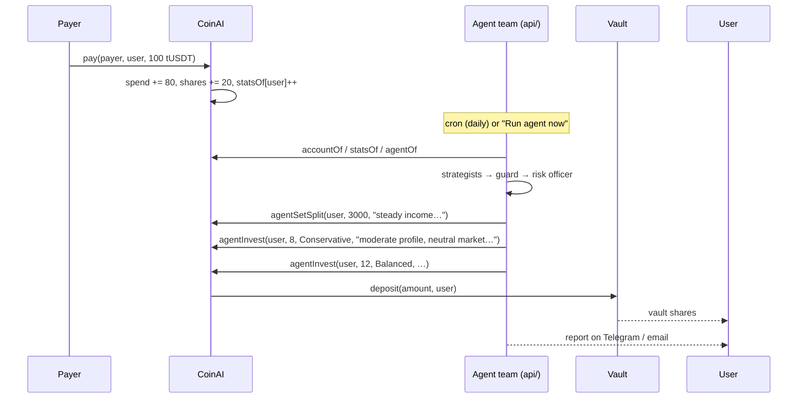

# Architecture

coinAI has three parts: an on-chain contract that splits payments and enforces the agent's limits, a React app, and an off-chain AI agent team that runs as Vercel Functions next to the app.

```
┌──────────────────────────── web/ (Vercel) ─────────────────────────────┐
│  src/  React SPA                        api/  Vercel Functions          │
│  ├─ landing, dashboard, yield,          ├─ auth.ts        wallet login  │
│  │  rules, withdraw, activity,          ├─ agent/run.ts   run the team  │
│  │  faucet, payment links               ├─ agent/chat.ts  chat advisor  │
│  ├─ /app/agent  permission, team, run,  ├─ agent/history  last 20 runs  │
│  │  chat, notifications, decisions      ├─ agent/profile  investor prof │
│  └─ /app/agent/:role  one page per agent├─ market.ts      market + read │
│                                         ├─ subscribe.ts   TG / email    │
│        │ wagmi + ethers                 ├─ telegram.ts    bot webhook   │
│        │                                └─ cron/daily.ts  daily report  │
└────────┼──────────────────────────────────────────┬────────────────────┘
         │ user txs                                  │ agent txs (agent wallet)
┌────────▼───────────────── BNB Smart Chain Testnet (97) ─────────────────┐
│  CoinAI (Save.sol)                                                      │
│   pay · withdrawSpend · withdrawSavings · investSavings                 │
│   setSplit · setLock · setYieldTarget                                   │
│   setAgent · revokeAgent · agentSetSplit · agentInvest                  │
│        │ approve + deposit(amount, user)                                │
│   ┌────▼─────────────┬───────────────────┬───────────────────┐          │
│   │ SimpleVault      │ SimpleVault       │ SimpleVault       │          │
│   │ Conservative 3%  │ Balanced 6%       │ Growth 12%        │          │
│   └──────────────────┴───────────────────┴───────────────────┘          │
│  MockUSDT (tUSDT, 6 decimals, faucet)                                   │
└─────────────────────────────────────────────────────────────────────────┘
         ▲ reads                                    OpenRouter (LLMs) · Upstash Redis
         └──── api/ ─────────────────────────────── Telegram Bot API · Gmail SMTP
```

## Smart contracts (`evm/src`)

### CoinAI (`Save.sol`)

Holds tUSDT received through `pay()` and keeps one account per user:

```solidity
struct Account {
    uint16  splitBps;     // % of each payment that goes to savings (default 2000 = 20%)
    uint128 spend;        // spendable balance
    uint128 shares;       // idle savings, 1:1 with tUSDT
    uint64  lockUntil;    // savings time-lock
    YieldTarget yieldTarget; // Conservative=0, Balanced=1 (default), Growth=2
}
struct Stats { uint128 totalReceived; uint64 paymentCount; uint64 lastPaymentAt; } // for agents
struct AgentPolicy { address agent; uint16 minSplitBps; uint16 maxSplitBps; uint64 expiry; }
```

| Function | Caller | What it does |
|---|---|---|
| `pay(from, to, amount)` | payer | Pulls tUSDT, splits into `spend` / `shares` of `to`, updates `statsOf[to]` |
| `withdrawSpend`, `withdrawSavings` | user | Withdraw to own wallet (savings respect `lockUntil`) |
| `investSavings(amount, target)` | user | Moves idle savings into a vault; vault shares minted to the user |
| `setSplit`, `setLock`, `setYieldTarget` | user | Rules |
| `setAgent(agent, minBps, maxBps, expiry)` / `revokeAgent()` | user | Delegate to (or remove) the AI agent |
| `agentSetSplit(user, bps, reason)` | agent | Only within `[minBps, maxBps]` and before `expiry` |
| `agentInvest(user, amount, target, reason)` | agent | Same as `investSavings`, shares go to the **user** |

Design choices:
- **Vault addresses are immutable** (constructor args) and there is **no owner/admin**. The agent can only route into those three vaults.
- **No path sends funds to the agent** or any third party. Vault shares are always minted to the user; withdrawals only go to `msg.sender == user`.
- Every agent call emits `AgentAction(user, agent, action, reason)` so decisions are auditable on BscScan.
- Custom errors (`NotAgent`, `InvalidPolicy`, `SplitOutOfRange`, …) are mapped to localized messages in the app.

### SimpleVault (`SimpleVault.sol`)

Minimal ERC-4626 vault, deployed three times with `apyBps` / `riskLevel` metadata. Share price tracks the vault's token balance. On testnet the APY is metadata, so the backend runs a **yield simulator** (`dripYield` in `web/api/_lib/chain.ts`): the agent wallet tops each vault up with tUSDT in proportion to its APY and the time since the last drip (sped up `YIELD_SPEEDUP`×, default 30), on every agent run and the daily cron. Share price, and every depositor's position, really grows on-chain. On mainnet these slots would route into live strategies (Venus, Lista, PancakeSwap).

Vault shares are minted to the user's own wallet, so the user takes a position back straight from the vault (`redeem` for all shares, `withdraw` for an amount) on the **Vault** tab of `/app/withdraw`; CoinAI isn't involved, and its savings lock only covers idle savings held in CoinAI. These withdrawals show in the activity feed from the vaults' `Withdraw` events.

### MockUSDT (`MockUSDT.sol`)

6-decimal ERC-20 with a public `faucet()` (1,000 tUSDT per address per 24h).

### coinAI v2 (`CoinAIV2.sol`, `BasketVault.sol`, `GroupFunds.sol`, `AgentRegistry.sol`)

Deployed with `script/DeployV2.s.sol` (addresses in `deployments.json` → `bscTestnet.v2`), next to the same tUSDT and yield vaults. Tests: `forge test` (unit), `forge test --match-contract Fork --fork-url https://bsc-testnet-dataseed.bnbchain.org` (against the live feeds and vaults).

- **CoinAIV2.** Same split and payments as v1 (plus `payMany`, ≤50 recipients). Savings stay inside the contract: idle tUSDT, vault shares held per user, and the user's basket, so the **savings lock covers every position** (v1 minted vault shares to the wallet, which let a locked user invest and redeem). Investing and moving between positions (`rebalance`) are allowed while locked; `withdrawPosition` isn't. Users authorize **up to 8 agents, each with its own skills**: `SPLIT` (split within the user's range), `INVEST` (invest idle savings, `agentRebalance` between the user's positions) and `PAY` (`agentContribute`: pay GroupFunds dues from the spendable balance, only into funds the user joined, within a budget per 30 days). Every way out pays the user; `contributeFromSpend` lets the user pay a fund from their spendable balance.
- **BasketVault ("AI Smart Money").** A basket per saver of tUSDT, BNB, BTC, ETH and CAKE (Chainlink on BSC). The agent wallet is the curator: `setSmartWeights(weights, reason)` publishes a new mix with its reason; followers move to it at their next action or via `sync`, keeping value; savers may set their own mix instead. The contract enforces ≥10% tUSDT, ≤50% per coin and ≤20% CAKE on every mix. Buying needs a fresh price (≤1 day); selling works at the last price, so a lagging oracle never locks money in. Testnet has no liquidity for these coins: buys and sells are bookkeeping at the oracle price, gains are paid from a tUSDT reserve (300 at deploy), losses stay in the vault; mainnet would swap on PancakeSwap.
- **GroupFunds.** *Patungan* (event/gift; organizer withdraws only once the target is met, refunds if the deadline passes short or it's cancelled), *Iuran* (dues per period; members join themselves, `duesOf` shows paid vs owed; a friend can `contributeFor` without making anyone a member) and *Donasi* (fundraising; withdrawals go to the fixed beneficiary with an on-chain memo). Contributions carry a message (≤140 bytes).
- **AgentRegistry.** Operators list an agent wallet with skills and a fee per 30 days; `hire(id, periods)` pays the operator and records `rentedUntil`. It moves no savings: what a hired agent may do is what the hirer grants it in CoinAIV2. Listed at deploy: Athena (invest), Demeter (split), Hermes (pay, 1 tUSDT / 30 days), all served by the agent wallet.

### DepositRouter (`DepositRouter.sol`)

Testnet on-ramp for tBNB: `depositBNB(minOut)` prices the tBNB with Chainlink BNB/USD, pays the tUSDT value from its reserve into the sender's coinAI account (`CoinAI.pay(router, user, amount)`, so the split and autopilot apply) and forwards the tBNB to the agent wallet for gas. `refill()` tops the reserve up from the faucet. On mainnet this becomes a PancakeSwap swap. tUSDT already in a wallet is deposited with a plain `pay(user, user, amount)`; both live in the "Deposit into coinAI" card on `/app/faucet`.

## Agent team (`web/api`)

See [ai-agents.md](ai-agents.md) for the full design. In short:

```
Chainlink (BSC) + Binance ─ Market Analyst ─┐
readUserState + profile ─┬─ Savings Strategist ─────┐
                         └─ Investment Strategist ──┴─ guard.ts ─ Risk Officer ─ executor ─ Reporter
```

- Orchestration is code (`api/_lib/swarm.ts`), not an LLM supervisor.
- `guard.ts` mirrors the contract rules so bad proposals are dropped before gas is spent; the contract is still the real enforcement.
- State for the agents comes from one `accountOf` / `statsOf` / `agentOf` read — no log scanning.
- Run history, subscriptions and rate limits live in Upstash Redis.

## Frontend (`web/src`)

| Area | Files |
|---|---|
| Chain + config | `lib/config.ts`, `lib/wagmi.ts` (BSC Testnet), `lib/ethers-wagmi.ts` (switch/add chain before signing) |
| Contract service | `lib/coinai.ts` → `coinai.evm.ts` or `coinai.mock.ts` (mock only with `VITE_MOCK=1`) |
| Token | `lib/token.ts` (tUSDT, faucet), `lib/format.ts` |
| Vault data | `lib/yield.ts`, `lib/use-yield-data.ts` — APY, risk, TVL, user position read from the vaults |
| Activity | `lib/activity.ts` — event history, newest-first in 5k-block chunks from `VITE_DEPLOY_BLOCK` |
| Agent | `lib/agent-api.ts` (wallet-signed login + bearer token), `pages/agent.tsx`, `pages/agent-role.tsx`, `lib/agent-roles.ts` |
| Market | `web/shared/market.ts` (Chainlink on BSC + Binance candles, shared with `api/`), `lib/use-market.ts`, `components/market-board.tsx` |
| Global state | `lib/app-state.tsx` — account, activity, `runAction` (tx + toast + refresh) |
| i18n | `lib/i18n.tsx` — en / id / zh |

### Routes

| Path | Page |
|---|---|
| `/` | Landing (film-led, `pages/landing.tsx`) |
| `/pay/:address` | Pay someone through their link |
| `/app` | Dashboard |
| `/app/agent` | AI agent: permission, team, run now, chat, notifications, decision log |
| `/app/agent/:role` | One page per agent: market, savings, investment, guardrails, risk, executor, reporter |
| `/app/chat` | Chat with coinAI (saved per wallet, shared with Telegram) |
| `/app/portfolio` | AI Portfolio: AI plan vs current vault positions, why, moves made |
| `/app/market` | Market board + pool simulator (90-day backtest, volatility range) + AI review of the pool |
| `/app/yield` | Vault position, move savings into a vault, vault list |
| `/app/rules` | Split, vault preference, time-lock |
| `/groups` | Group funds hub, a standalone page like `/pay` (`GroupShell`: landing art, glass cards, no sidebar): 388 × 440 cards with the kind's art, progress and your status, filters by kind and mine / joined; empty states show 388 × 440 start-a-group panels |
| `/groups/new` | Create in three steps in one card: kind (three readable cards in a row), details with a live card preview, review with what happens next. Footer sticks to the bottom on phones |
| `/groups/:id`, `/g/:id` | Group page: summary + rules, the action for this user (join, pay N periods, chip in, refund; first under the summary on phones), members with paid-up status, on-chain feed with messages and memos, organizer payouts, and the **share card**: a ready-to-post image (feed 4:5 or story 9:16, `src/lib/share-card.ts`, drawn on a canvas in the app's type and art, with a QR to `/g/:id`) to download or send through the phone's share sheet, plus WhatsApp / X / Telegram / Facebook links. `/app/groups/*` redirects here |
| `/app/withdraw`, `/app/activity`, `/app/link`, `/app/faucet`, `/app/settings` | — |

## Invoices and receipts

`/app/link` creates **invoices** (`api/invoices.ts`, `api/_lib/invoices.ts`): a fixed amount in rupiah or tUSDT, a memo and the merchant's reference, stored in Redis (`inv:<id>`, the merchant's last 50 under `invs:<wallet>`). The payer opens `/pay/<merchant>?invoice=<id>`; a rupiah amount converts to tUSDT at the server's IDR rate (open.er-api, cached 10 min), rounded up to the cent with the same `requiredUnits` the server checks (`web/shared/invoice.ts`). After the payment the page sends the tx hash to `POST /api/invoices?paid`, and the server marks the invoice paid only if the mined tx holds a CoinAI `PaymentRouted` to that merchant made after the invoice, covering the amount (2% rate slack for rupiah), and the tx hasn't settled another invoice (`invtx:<hash>`, set once).

Every payment made through the pay page also reaches `POST /api/agent/autopilot` with its tx hash. The server reads the payment from the chain and sends the recipient a **Telegram receipt** (amount, payer, the invoice if any, what was saved), once per tx (`receipt:<hash>`), even when the agent isn't enabled. The text is written in code (`api/_lib/receipts.ts`, en/id/zh), so it arrives when the LLMs are down.

`api/invoices.ts` is the 12th Vercel function, the Hobby plan's limit: add new server routes as `?action` branches of existing functions. It also serves **link previews** for shared groups: `vercel.json` rewrites `/g/:id` to `/api/invoices?og=:id`, which reads the group from the chain and returns a tiny page with Open Graph / Twitter tags (title, one-line summary, the kind's art; everything HTML-escaped, `api/_lib/og.ts`) that sends people on to `/groups/:id`. Locally (vite) `/g/:id` renders the group page directly.

## Payment → agent flow


