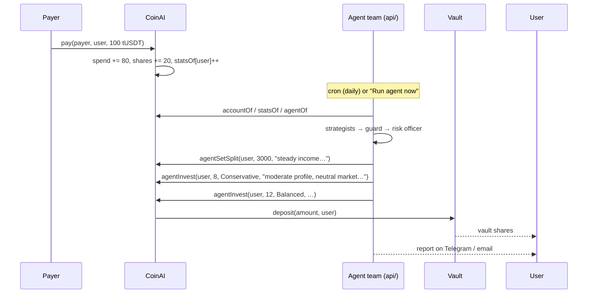

# Architecture

coinAI has three parts: an on-chain contract that splits payments and enforces the agent's limits, a React app, and an off-chain AI agent team that runs as Vercel Functions next to the app.

```
┌──────────────────────────── web/ (Vercel) ─────────────────────────────┐
│  src/  React SPA                        api/  Vercel Functions          │
│  ├─ landing, dashboard, yield,          ├─ auth.ts        wallet login  │
│  │  rules, withdraw, activity,          ├─ agent/run.ts   run the team  │
│  │  faucet, payment links               ├─ agent/chat.ts  chat advisor  │
│  ├─ /app/agent  permission, team, run,  ├─ agent/history  last 20 runs  │
│  │  chat, notifications, decisions      ├─ agent/profile  investor prof │
│  └─ /app/agent/:role  one page per agent├─ market.ts      market + read │
│                                         ├─ subscribe.ts   TG / email    │
│        │ wagmi + ethers                 ├─ telegram.ts    bot webhook   │
│        │                                └─ cron/daily.ts  daily report  │
└────────┼──────────────────────────────────────────┬────────────────────┘
         │ user txs                                  │ agent txs (agent wallet)
┌────────▼───────────────── BNB Smart Chain Testnet (97) ─────────────────┐
│  CoinAI (Save.sol)                                                      │
│   pay · withdrawSpend · withdrawSavings · investSavings                 │
│   setSplit · setLock · setYieldTarget                                   │
│   setAgent · revokeAgent · agentSetSplit · agentInvest                  │
│        │ approve + deposit(amount, user)                                │
│   ┌────▼─────────────┬───────────────────┬───────────────────┐          │
│   │ SimpleVault      │ SimpleVault       │ SimpleVault       │          │
│   │ Conservative 3%  │ Balanced 6%       │ Growth 12%        │          │
│   └──────────────────┴───────────────────┴───────────────────┘          │
│  MockUSDT (tUSDT, 6 decimals, faucet)                                   │
└─────────────────────────────────────────────────────────────────────────┘
         ▲ reads                                    OpenRouter (LLMs) · Upstash Redis
         └──── api/ ─────────────────────────────── Telegram Bot API · Gmail SMTP
```

## Smart contracts (`evm/src`)

### CoinAI (`Save.sol`)

Holds tUSDT received through `pay()` and keeps one account per user:

```solidity
struct Account {
    uint16  splitBps;     // % of each payment that goes to savings (default 2000 = 20%)
    uint128 spend;        // spendable balance
    uint128 shares;       // idle savings, 1:1 with tUSDT
    uint64  lockUntil;    // savings time-lock
    YieldTarget yieldTarget; // Conservative=0, Balanced=1 (default), Growth=2
}
struct Stats { uint128 totalReceived; uint64 paymentCount; uint64 lastPaymentAt; } // for agents
struct AgentPolicy { address agent; uint16 minSplitBps; uint16 maxSplitBps; uint64 expiry; }
```

| Function | Caller | What it does |
|---|---|---|
| `pay(from, to, amount)` | payer | Pulls tUSDT, splits into `spend` / `shares` of `to`, updates `statsOf[to]` |
| `withdrawSpend`, `withdrawSavings` | user | Withdraw to own wallet (savings respect `lockUntil`) |
| `investSavings(amount, target)` | user | Moves idle savings into a vault; vault shares minted to the user |
| `setSplit`, `setLock`, `setYieldTarget` | user | Rules |
| `setAgent(agent, minBps, maxBps, expiry)` / `revokeAgent()` | user | Delegate to (or remove) the AI agent |
| `agentSetSplit(user, bps, reason)` | agent | Only within `[minBps, maxBps]` and before `expiry` |
| `agentInvest(user, amount, target, reason)` | agent | Same as `investSavings`, shares go to the **user** |

Design choices:
- **Vault addresses are immutable** (constructor args) and there is **no owner/admin**. The agent can only route into those three vaults.
- **No path sends funds to the agent** or any third party. Vault shares are always minted to the user; withdrawals only go to `msg.sender == user`.
- Every agent call emits `AgentAction(user, agent, action, reason)` so decisions are auditable on BscScan.
- Custom errors (`NotAgent`, `InvalidPolicy`, `SplitOutOfRange`, …) are mapped to localized messages in the app.

### SimpleVault (`SimpleVault.sol`)

Minimal ERC-4626 vault, deployed three times with `apyBps` / `riskLevel` metadata. Share price tracks the vault's token balance. On testnet the APY is display metadata only; on mainnet these slots would route into live strategies (Venus, Lista, PancakeSwap).

### MockUSDT (`MockUSDT.sol`)

6-decimal ERC-20 with a public `faucet()` (1,000 tUSDT per address per 24h).

## Agent team (`web/api`)

See [ai-agents.md](ai-agents.md) for the full design. In short:

```
Chainlink (BSC) + Binance ─ Market Analyst ─┐
readUserState + profile ─┬─ Savings Strategist ─────┐
                         └─ Investment Strategist ──┴─ guard.ts ─ Risk Officer ─ executor ─ Reporter
```

- Orchestration is code (`api/_lib/swarm.ts`), not an LLM supervisor.
- `guard.ts` mirrors the contract rules so bad proposals are dropped before gas is spent; the contract is still the real enforcement.
- State for the agents comes from one `accountOf` / `statsOf` / `agentOf` read — no log scanning.
- Run history, subscriptions and rate limits live in Upstash Redis.

## Frontend (`web/src`)

| Area | Files |
|---|---|
| Chain + config | `lib/config.ts`, `lib/wagmi.ts` (BSC Testnet), `lib/ethers-wagmi.ts` (switch/add chain before signing) |
| Contract service | `lib/coinai.ts` → `coinai.evm.ts` or `coinai.mock.ts` (mock when `VITE_COINAI_ADDRESS` is empty) |
| Token | `lib/token.ts` (tUSDT, faucet), `lib/format.ts` |
| Vault data | `lib/yield.ts`, `lib/use-yield-data.ts` — APY, risk, TVL, user position read from the vaults |
| Activity | `lib/activity.ts` — event history, newest-first in 5k-block chunks from `VITE_DEPLOY_BLOCK` |
| Agent | `lib/agent-api.ts` (wallet-signed login + bearer token), `pages/agent.tsx`, `pages/agent-role.tsx`, `lib/agent-roles.ts` |
| Market | `web/shared/market.ts` (Chainlink on BSC + Binance candles, shared with `api/`), `lib/use-market.ts`, `components/market-board.tsx` |
| Global state | `lib/app-state.tsx` — account, activity, `runAction` (tx + toast + refresh) |
| i18n | `lib/i18n.tsx` — en / id / zh |

### Routes

| Path | Page |
|---|---|
| `/` | Landing (film-led, `pages/landing.tsx`) |
| `/pay/:address` | Pay someone through their link |
| `/app` | Dashboard |
| `/app/agent` | AI agent: permission, team, run now, chat, notifications, decision log |
| `/app/agent/:role` | One page per agent: market, savings, investment, guardrails, risk, executor, reporter |
| `/app/chat` | Chat with coinAI (saved per wallet, shared with Telegram) |
| `/app/yield` | Vault position, move savings into a vault, vault list |
| `/app/rules` | Split, vault preference, time-lock |
| `/app/withdraw`, `/app/activity`, `/app/link`, `/app/faucet`, `/app/settings` | — |

## Payment → agent flow


