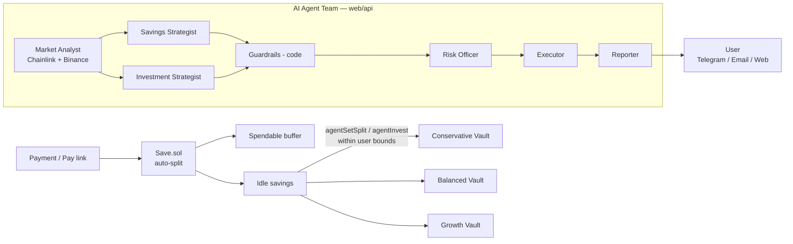
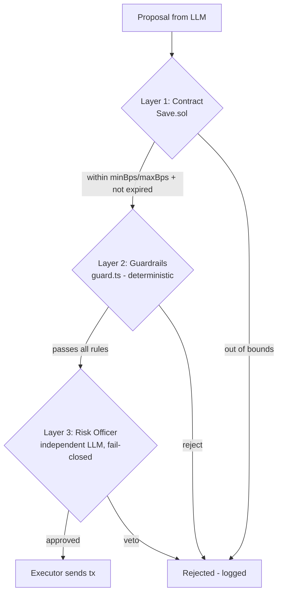

# coinAI — AI-Agent-Managed Auto-Savings on Every Payment

> **Indonesia Web3 Hackathon 2026 · AI Agents track**
> Live demo: https://coinai-gamma.vercel.app
> Contracts: BSC Testnet (chain 97) · App: Vercel · Agents: OpenRouter + Vercel Functions

---

## Problem Statement

Most people live paycheck-to-paycheck — not because they earn too little, but because **saving requires a decision they never make**. Every payment that comes in is immediately spendable, and the moment of *"I should save a slice of this"* almost never happens.

Existing solutions fail in three ways:

1. **Manual savings apps** depend on willpower — the exact thing that fails under spending pressure.
2. **Auto-debit / round-up savings** lock money away rigidly, without adapting to irregular income (freelancers, gig workers) or to market conditions.
3. **DeFi yield tools** assume financial literacy — users must understand vaults, impermanent loss, gas, and market timing — and give them no agent to do the work.

The result: hundreds of millions of earners in emerging markets never benefit from on-chain yield, even though the rails (BSC, stablecoins, yield vaults) exist and are nearly free to use.

---

## Solution

**coinAI** is an **AI-agent-managed auto-savings layer**: a slice of every payment received is saved automatically, then an on-chain-permitted **team of AI agents** decides how to split it between a spendable cash buffer and three yield vaults — **inside limits the user signs on-chain**.

| Problem | coinAI's answer |
|---|---|
| Willpower fails | Savings happen **at the payment layer** — a payment link / contract call routes a % into savings before the user can spend it |
| Static, no adaptation | Agents re-evaluate **every payment + daily**: payment frequency, spendable buffer, market regime (risk-on / neutral / risk-off from Chainlink feeds + Binance volatility) → adjust split |
| Rigid lock-ups | User keeps a **spendable buffer**; only the *idle* excess is invested. Withdraw anytime from vaults |
| Too complex for users | The AI team does everything: Market Analyst → Savings Strategist → Investment Strategist → Guardrails → Risk Officer → Executor → Reporter. The user just reads a report in Bahasa Indonesia |
| "AI can steal my funds" | **Three deterministic layers**: (1) contract bounds `minBps / maxBps / expiry`, (2) code guardrails reject bad proposals *before* they cost gas, (3) an independent Risk Officer LLM that can only **veto**, never modify. Worst case: funds move within the user's own vaults |

---

## Architecture



---

## Three Layers of Safety

The LLMs decide; **the smart contract decides what is allowed**.



1. **Contract** (`evm/src/Save.sol`) — `agentSetSplit` requires `minSplitBps ≤ bps ≤ maxSplitBps` and `now < expiry`. `agentInvest` can only deposit the user's idle savings into one of three immutable vaults with `receiver = user`. **There is no function that transfers to the agent or anyone else.** `revokeAgent()` cuts access in one tx.
2. **Guardrails** (`web/api/_lib/guard.ts`) — the same rules in code, so bad proposals never cost gas. Covered by `node --test api/_lib/guard.test.ts`.
3. **Risk Officer** — an independent LLM review that **fails closed** (missing/invalid review = rejected).

**Worst case with a jailbroken or confused model**: the split moves within the user's range, or idle savings move into the user's own vault position. Both are visible and reversible by the user.

---

## AI Agent Team (7 roles + chat)

| Role | Kind | Job | Can it move funds? |
|---|---|---|---|
| **Market Analyst** | LLM | Reads BNB, BTC, ETH, CAKE (Chainlink feeds on BSC, 30-day trend + volatility from Binance) → calls regime `risk_on` / `neutral` / `risk_off`. Cached 30 min, shared by all users | No — read-only |
| **Savings Strategist** | LLM | Proposes a new savings split from payment frequency, size, days since last payment, spendable buffer and the user's goal | No — proposes only |
| **Investment Strategist** | LLM | Splits idle savings across Conservative / Balanced / Growth from the investor profile (risk, horizon, goal), tilted by market regime — automatic DCA on every payment | No — proposes only |
| **Guardrails** | **Code** | Rejects anything outside the user's policy, over the idle savings still uncommitted, locked, or without a reason | No |
| **Risk Officer** | LLM | Reviews each surviving proposal — can **veto, never modify**. Missing review = rejected | No |
| **Executor** | **Code** | Sends approved proposals from the agent wallet: `agentSetSplit`, then one `agentInvest` per vault | Only into the user's own vault positions |
| **Reporter** | LLM | Writes the update in the user's language (en / id / zh): what came in, the market read, what each agent did and why, reminders | No |
| **Chat Advisor** | LLM + tools | Answers questions (`get_state`, `get_market`, `get_recent_runs`); for any change it calls `run_agent_team(instruction)` instead of acting itself | No |

The orchestrator (`web/api/_lib/swarm.ts`) is **plain TypeScript** — the sequence is fixed and every step is recorded (`analyzed / proposed / skipped / rejected / approved / executed / failed`). Orchestration is code, not an LLM supervisor.

### When the team runs

| Trigger | Endpoint | Executes txs? |
|---|---|---|
| "Run agent now" in `/app/agent` | `POST /api/agent/run` (1×/min per user) | Yes |
| Chat: "I want to save more for December" | `POST /api/agent/chat` → `run_agent_team` | Yes |
| Daily cron, 08:00 WIB | `GET /api/cron/daily` | Yes, then sends the report |
| Telegram chat / `/run` | `POST /api/telegram` | Only via `run_agent_team` |

---

## On-chain Contracts (BSC Testnet · chain 97)

| Contract | Address | Notes |
|---|---|---|
| **CoinAI** (main) | `0xdA174816F66E30eBB3a002bcf5a71AD00037eBD9` | Payment split, agent bounds, vault registry |
| **MockUSDT (tUSDT)** | `0x49eD8CC30FC55Ed36e976285d98eF00F213C31E2` | 6 decimals, `faucet()` = 1,000/day |
| Vault Conservative (cvUSDT) | `0x1b013Af5755CB96d9314A5074391931EBCd40ACa` | 3% APR, risk-off |
| Vault Balanced (bvUSDT) | `0x4071DdCe831E484640e864a8627cc3ece308e895` | 6% APR, neutral |
| Vault Growth (gvUSDT) | `0xf9B035426d2A16EF00F0547dc0F4Ed9226D2671d` | 12% APR, risk-on |
| DepositRouter | `0x2e72901f3350b7f3f5E4E35918a6e4b4dC5bf104` | tBNB → tUSDT on-ramp, Chainlink BNB/USD priced |

- Explorer: https://testnet.bscscan.com/address/0xdA174816F66E30eBB3a002bcf5a71AD00037eBD9
- Deploy block: `133234240` (MockUSDT; the vaults and CoinAI landed in `133234241`). Activity history is read from `133234240`.
- Agent wallet (sends `agentSetSplit` / `agentInvest`, receives DepositRouter tBNB for gas): `0x03c8faF61c40F35CCFFd8fDcCa7F037C2dB2f6C6`
- Deployer: `0x72092971935F31734118fD869A768aE17C84dd0B`

---

## Market Data

| Data | Source |
|---|---|
| Spot price | **Chainlink price feed proxies on BSC Testnet** — BNB, BTC, ETH, CAKE (8 decimals) |
| 24h / 7d / 30d change, 30-day annualized volatility | **Binance daily candles** via `data-api.binance.vision` |

The same module powers the market board in the browser (works without the backend) and the Market Analyst on the server. If the oracle read fails, the latest Binance close is used and labelled as such.

---

## Investor Profile

Stored per user in Redis (`profile:<address>`), edited on `/app/agent/investment`:

| Field | Values |
|---|---|
| `risk` | `conservative` · `moderate` (default) · `aggressive` |
| `horizon` | `short` (< 6 months) · `medium` (6–24 months, default) · `long` (2+ years) |
| `goal` | free text, ≤ 140 chars (e.g. *"trip to Bali in December"*) |

---

## Reports & Delivery Channels

Reminders are computed **in code** (not by the LLM) and passed to the Reporter:

- agent permission expires within 3 days / agent not enabled
- savings lock ends within 3 days
- no payment received for 7+ days
- idle savings ≥ 10 tUSDT not earning yield

| Channel | How |
|---|---|
| **Telegram** | Bot API, one-time deep link `t.me/<bot>?start=<code>` after wallet login; `/run`, `/report`, `/market`, free-text chat |
| **Email** | Gmail SMTP via `nodemailer` (App Password) — swappable to Resend / Postmark / SES in one function |
| **Web** | `/app/agent` — role pages, decision log, live market board |

---

## Tech Stack

| Layer | Stack |
|---|---|
| Contracts | **Foundry / Solidity 0.8.28** — `Save.sol`, `SimpleVault.sol`, `MockUSDT.sol` |
| Frontend | **React 19 + Vite + TS**, wagmi / ethers, 3 locales (en / id / zh) |
| Backend | **Vercel Functions** (TypeScript), plain-code orchestration |
| LLM | **OpenRouter** — per-role model config, `json_object` structured output |
| Data | **Upstash Redis** (sessions, snapshots, chat memory), Chainlink, Binance |
| Delivery | Telegram Bot API, Gmail SMTP |
| CI / Deploy | Vercel (dashboard), Foundry scripts for deploys |

---

## What's Genuinely Novel

1. **Savings at the payment layer**, not after-the-fact — auto-split on receipt, so willpower is never involved.
2. **Multi-agent team with deterministic guardrails** — LLMs propose, *code* decides what's allowed, a second LLM can only veto. Fail-closed by design.
3. **Market-aware allocation** — regime detection (volatility + trend) tilts the vault split on every run → automatic, adaptive DCA.
4. **User signs their own limits on-chain** — the AI cannot exceed `minBps / maxBps / expiry`; the worst case is funds moving inside the user's own positions, visible and reversible in one tx (`revokeAgent()`).

---

## Demo Flow

1. **Faucet** → `/app/faucet` — grab tBNB (link) + mint 1,000 tUSDT
2. **Connect wallet** → dashboard shows savings, buffer, vault positions
3. **Set agent** → `setAgent(agent, minBps, maxBps, expiry)` — sign your own limits
4. **Run the team** → `/app/agent` → "Run agent now" (or chat / Telegram `/run`)
5. **Watch the pipeline** → each role's page shows what it read, its limits, and its decisions
6. **Receive the report** → in-app, Telegram, or email — in your language
7. **Revoke anytime** → `revokeAgent()` in one transaction

---

## Repository Layout

```
coinai/
├── evm/                    # Foundry workspace
│   ├── src/Save.sol        # Main contract — payment split + agent bounds
│   ├── src/SimpleVault.sol # 3 yield vaults (conservative / balanced / growth)
│   ├── src/MockUSDT.sol    # 6-decimal test stablecoin + faucet
│   ├── script/DeployAll.s.sol
│   └── test/
└── web/                    # React app + Vercel Functions
    ├── src/                # Frontend (i18n: en / id / zh)
    ├── api/                # Serverless backend
    │   ├── _lib/swarm.ts   # Agent orchestration (plain TS)
    │   ├── _lib/guard.ts   # Deterministic guardrails (+ tests)
    │   ├── _lib/llm.ts     # OpenRouter client
    │   ├── agent/          # run / chat / profile endpoints
    │   ├── cron/daily.ts   # 08:00 WIB daily report
    │   └── telegram.ts     # Bot webhook
    ├── shared/market.ts    # Chainlink + Binance snapshot (shared app/server)
    └── scripts/setup-telegram.sh
```
